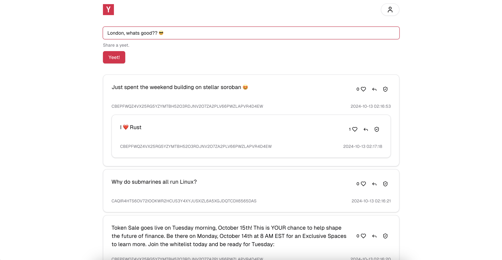
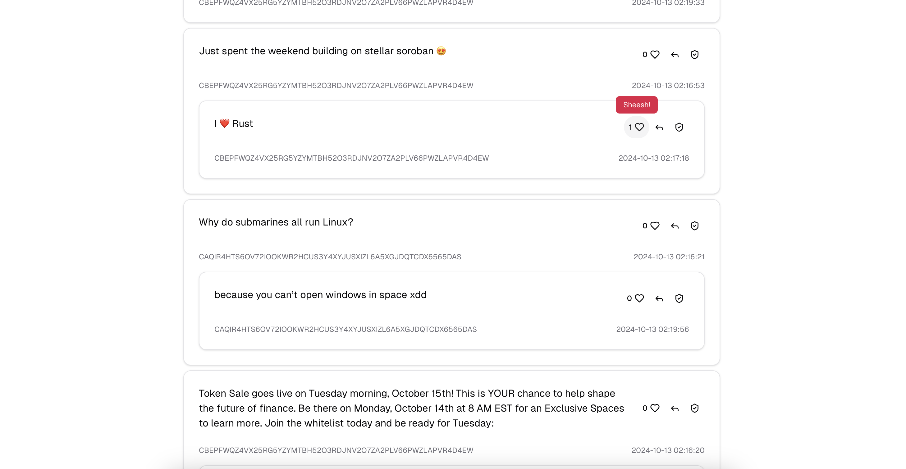
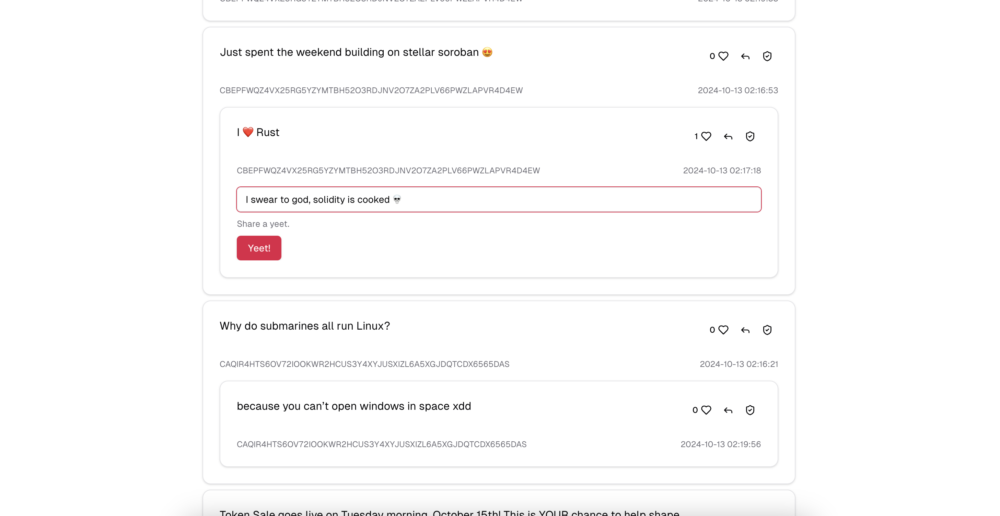
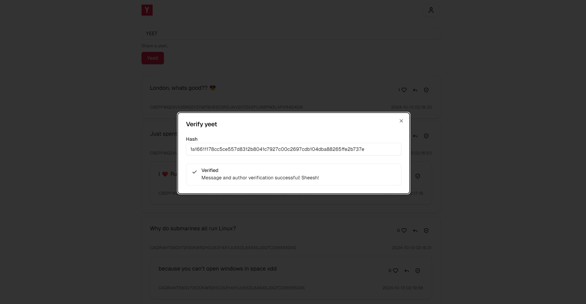

<h1 align="center">

</h1>

<h4 align="center">
  <a href="https://y-zeta-six-11.vercel.app/">Website</a> |
  <a href="https://github.com/Stellarnauts/y">Github</a>
  

    
  

</h4>

<h3 align="center">
y dot com the nothing app
</h3>

🫰 Are you tired of the fast-paced internet dictating our everyday lives? Sick of being socially responsible for a trail of digital footprints that might one day come back to haunt you? Frustrated with expressing yourself on platforms where you're not fully in charge—where you might get shadowbanned, or worse, your account might get deleted?

Introducing Y, a new social dApp that leverages Soroban's temporary data storage for your posts—or "yeets," as we call them. Each time a yeet is liked or replied to, its TTL (Time to Live) is extended. This way, objectively uninteresting yeets will disappear, providing our users with an algorithm-free experience showcasing only the most engaging content. We hope to see more platforms like this, where content is intentionally limited to occupy as little of our users' time as possible, ensuring that what's actually there enriches their lives.

⚙️ Built using NextJS, rust and Stellar Soroban.

- ✅ **User friendly UX**: We aimed to build a simple and stress free user experience that is intuitive for everyone.
- 🧱 **Interest based lifetimes**: You as the user will only see what is established to be intresting and interactive, incentivising people to actually act in a social manner on our platform
- 🖥️ **Tamper Proof Data**: Since the data is stored on Stellar, the information is verifiable true and you can have reasurance that the information you see is correct.

## Screenshots

| Write Yeet                       | Like Yeet                       |
| -------------------------------- | ------------------------------- |
|  |  |

| Reply                            | Verify                            |
| -------------------------------- | --------------------------------- |
|  |  |

## Links

- [Live dApp on Vercel](https://y-zeta-six-11.vercel.app/)
- [Github: Dapp monorepo](https://github.com/Stellarnauts/y)
- [Presentation slides](https://www.canva.com/design/DAGTaO9reGI/W5teo1eoYNaAERMCbGnczw/edit?utm_content=DAGTaO9reGI&utm_campaign=designshare&utm_medium=link2&utm_source=sharebutton)
- [Presentation video](https://www.youtube.com/watch?v=9Iuu-B8WA6M)

### Deployed contracts

- [y on stellar](https://stellar.expert/explorer/testnet/contract/CAFUQONPIJP7ZBXSZCHAY2PIHY4PSGSU2OGJ3HKVD62APNWC5HJS6HVU)

## Team

- [0xjsi.eth](https://twitter.com/0xjsieth)
- [0xZATARR](https://x.com/0xZATARR)
